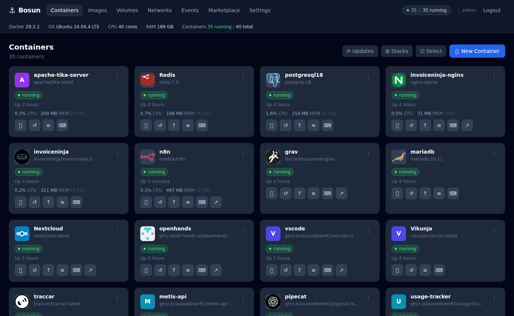

# Bosun

A self-hosted Docker management UI built for homelabbers. Bosun stores container configurations as XML files and generates `docker-compose.yml` files from them, so your setup survives image rebuilds and can be version-controlled or backed up independently of the containers themselves.



---

## Features

**Container Management**
- Deploy, start, stop, restart, and remove containers
- Per-container configuration: image, ports, volumes, environment variables, labels, sysctls, networks, restart policy, depends_on
- Stack grouping by Docker Compose project label
- Bulk actions (start/stop/restart multiple containers at once)
- Real-time CPU and memory stats on each card
- Health check status badges (healthy / unhealthy / starting)
- Web UI shortcut link and custom icon per container

**Updates**
- Update available badges via registry digest comparison (no pulling required to check)
- One-click pull & redeploy from the dashboard
- Scheduled auto-update with per-container or global cron schedule (Watchtower replacement)
- Automatic old image cleanup after updates
- Update history log

**Marketplace**
- 60+ curated self-hosted app templates (pre-filled ports, volumes, env vars)
- Docker Hub search with live results and pagination
- "Installed" badge on apps already deployed
- Port conflict detection before deploying

**System**
- Images page: list, remove, prune dangling images
- Volumes page: list, remove, identify which containers use each volume
- Networks page: list, create, remove, inspect connected containers
- Events page: live Docker daemon event stream with filtering

**Terminal & Logs**
- Full in-browser terminal via xterm.js (exec into any running container)
- Live log viewer with follow mode, opens in a dedicated tab

**Authentication**
- Local username/password (bcrypt, JWT)
- [Authentik](https://goauthentik.io/) forward-auth support — no password needed when behind a proxy
- Per-user account management

**Backup & Restore**
- Export all container configs as a single JSON file
- Import/restore with overwrite or skip-existing mode

---

## Quick Start

### 1. Find your Docker group GID

```bash
getent group docker | cut -d: -f3
```

### 2. Create a `.env` file

```bash
cp .env.example .env
```

Edit `.env` and set at minimum:
- `DOCKER_GID` — from step 1
- `JWT_SECRET` — a long random string (`openssl rand -hex 32`)
- `TZ` — your timezone (e.g. `America/New_York`)
- `BOSUN_DATA_DIR` — where configs and data are stored (default: `./data`)

### 3. Build and run

```bash
docker compose up -d --build
```

Open `http://localhost:4080`. On first visit you'll be prompted to create an admin account.

---

## Configuration

All configuration is via environment variables:

| Variable | Default | Description |
|---|---|---|
| `JWT_SECRET` | *(required)* | Secret for signing JWTs. Use `openssl rand -hex 32`. |
| `BOSUN_DATA_DIR` | `./data` | Host path to store configs, compose files, and user data |
| `BOSUN_PORT` | `4080` | Host port to expose |
| `TZ` | `UTC` | Container timezone |
| `DOCKER_GID` | `999` | GID of the `docker` group on the host (build arg) |

### Docker Group GID

Bosun needs to run `docker compose` commands on the host. It does this by joining the host's `docker` group inside the container. The GID must match between host and container.

```bash
# Find your host docker GID
getent group docker | cut -d: -f3

# Pass it at build time
DOCKER_GID=996 docker compose up -d --build
# or set it in .env
```

### Data Directory Structure

```
data/
├── configs/        # Container XML configurations
├── compose/        # Generated docker-compose.yml files (one per container)
├── data/
│   ├── users.json      # User accounts (bcrypt hashed passwords)
│   ├── settings.json   # App settings
│   └── updates.log     # Auto-update activity log
```

The `configs/` and `data/` directories are the only things you need to back up (or use Bosun's built-in export).

---

## Reverse Proxy

Bosun runs on port `4080`. To put it behind a reverse proxy, remove the `ports:` mapping and attach it to your proxy network.

**Caddy example:**
```caddy
bosun.yourdomain.com {
    reverse_proxy bosun:4080
}
```

**docker-compose.yml addition:**
```yaml
services:
  bosun:
    # remove or comment out ports:
    networks:
      - proxy

networks:
  proxy:
    external: true
```

---

## Authentik Forward Auth

Bosun supports [Authentik](https://goauthentik.io/) proxy authentication. When a request arrives with the `X-Authentik-Username` header set (by your Authentik outpost), Bosun skips its own login and trusts the header as the authenticated user.

This means you can protect Bosun with Authentik SSO (MFA, LDAP, social login, etc.) without any additional configuration in Bosun itself.

**Setup in Authentik:**
1. Create a Proxy Provider in forward-auth (single application) mode
2. Point it at `http://bosun:4080`
3. Add the application to an outpost
4. Protect with whatever authentication flows you want

---

## Auto-Update

Bosun can automatically pull and redeploy containers on a schedule, replacing Watchtower.

**Global enable** — Settings → Auto-Update → Enable auto-updates globally

When enabled globally, all managed containers update on the default cron schedule. Individual containers can override the schedule in their config (Container Editor → Advanced).

**Default schedule:** `0 3 * * *` (3 AM daily)

Old images are automatically pruned after each update (equivalent to `WATCHTOWER_CLEANUP=true`).

**Manual controls in Settings → Auto-Update:**
- Check for Updates — runs digest comparison for all containers and shows update badges
- Run Updates Now — immediately pulls and redeploys all containers
- Update log — real-time activity log with colour-coded entries

---

## Marketplace

The marketplace has two sections:

**Curated Apps** — 60+ templates for popular self-hosted apps across categories: Media, Photos, Download & Arr, Productivity, Dev Tools, Monitoring, Security, Databases, Networking, Home & IoT, AI & ML. Each template pre-fills sensible defaults for ports, volumes, and environment variables.

**Docker Hub Search** — Search any image on Docker Hub and deploy it directly with a minimal config.

Both open the full Container Editor pre-filled, so you can review and adjust everything before deploying.

---

## Development

```bash
# Install deps
cd frontend && npm install
cd ../backend && npm install

# Run backend (with nodemon or just node)
cd backend && node index.js

# Run frontend dev server (proxies API to localhost:4080)
cd frontend && npm run dev
```

The frontend dev server proxies all `/api` requests to `http://localhost:4080`, so you can run them side by side.

**Requirements:**
- Node.js 20+
- Docker and Docker Compose installed on the host
- The user running the backend must be in the `docker` group

---

## How It Works

Each container has an XML config file in `data/configs/`. When you deploy or update a container, Bosun:

1. Reads the XML config
2. Generates a `docker-compose.yml` in `data/compose/<name>/`
3. Runs `docker compose up -d` in that directory

This means:
- Configs are plain text and can be version-controlled
- Each container's compose file is human-readable and works without Bosun
- Recreating the Bosun container itself doesn't lose any managed container configs

---

## License

MIT — see [LICENSE](LICENSE)
